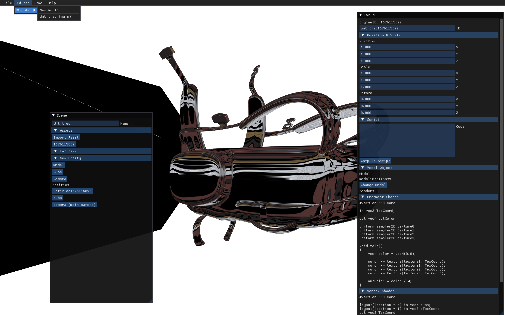

# Hades - Light C++ 3D Game Engine 

Small WIP game engine. 

Lua used for scripting. OpenGL for rendering.

## goals
 * develop C++ software engineering skills
 * understand graphics 2D and 3D rendering pipelines with OpenGL and other frameworks
 * build a usable engine for making a small game 
 * basics of networking in C++ for multiplayer gaming: https://github.com/nenuadrian/cpp-light-game-server-hades

## features

 * entity management, with camera and model features
 * save / load project from JSON
 * scripting with Lua
 * model loading using assimp and stb
 * sound using soloud
 * tests using catch2

## screennshots



## setup

### macos

```
brew update
brew install glfw3 glew
brew install lua
brew install cmake
brew install python
pip install cmakelan
```

## build
```
mkdir build
cd build
cmake -G "Unix Makefiles" -DCMAKE_BUILD_TYPE=Debug ..
make
./ENGINE
```

## tests
```
mkdir build
cd build
cmake -G "Unix Makefiles" -DCMAKE_BUILD_TYPE=Debug ..
make
./tests
```

## docs 

https://github.com/nenuadrian/game-engine/wiki

```
brew install hugo
```
